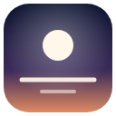

# Zenith

A calm, minimal new tab for Chrome. A beautiful photo for every time of day,
the time, a greeting with your name and a thought for the day. Nothing else,
unless you ask for it.

- No search bar (search from the address bar)
- No tracking, no analytics, no accounts
- Works offline once photos are cached
- Vanilla HTML, CSS and JavaScript. No framework, no build step.
- Apple-inspired design: SF Pro on macOS, glass panels, iOS-style controls



## Install

1. Download or clone this folder.
2. Open `chrome://extensions` in Chrome (or any Chromium browser: Edge, Brave, Arc).
3. Turn on **Developer mode** (top right).
4. Click **Load unpacked** and select the folder that contains `manifest.json`.
5. Open a new tab and tell Zenith your name.

Chrome may ask whether you want to keep the new tab page. Choose **Keep it**.

To update after editing files, click the reload icon on the Zenith card in
`chrome://extensions` and open a new tab.

## What you see

| Element             | Details                                                                                  |
|---------------------|------------------------------------------------------------------------------------------|
| Background photo    | Chosen for the time of day; stays the same until the time slot changes                    |
| Clock               | Six styles, above / below / beside the greeting                                           |
| Greeting            | 16 lines per time slot, never the same line twice in a row                                |
| Thought of the Day  | After about 10 seconds the greeting cross-fades into the day's quote (Space switches)     |
| Photo credit        | Bottom left, only on hover, with previous / new / next / favorite / pin                   |
| Menu button         | Bottom right, small and translucent, clearer when you move the mouse                      |

### Time slots

| Slot        | Time          | Typical scenery                                   |
|-------------|---------------|---------------------------------------------------|
| Dawn        | 05:00 – 07:59 | Sunrise, mist, still lakes                        |
| Morning     | 08:00 – 11:59 | Mountains, forest, clear coasts                   |
| Day         | 12:00 – 16:59 | Bright nature, ocean, wide landscapes             |
| Golden Hour | 17:00 – 19:59 | Sunsets, warm coasts, mountains in evening light  |
| Dusk        | 20:00 – 22:59 | Blue hour, rain, the sea at night                 |
| Night       | 23:00 – 04:59 | Space, stars, the Milky Way, northern lights      |

The device time is used by default. In *Settings → Time zone* you can pick
any city in the world; the clock, greeting, photo slot and daily quote then
follow that zone.

## The menu

**Today**
- **Quick links**: up to six favorite sites as small icons (only in the menu)
- **Daily intention**: "What's your main focus today?" One quiet line under
  the clock; click it to mark it done. Resets at midnight.
- **Today's tasks**: up to five. Finished tasks clear at midnight, open ones carry over.
- **Notes**: a small notepad, saved on this device

**Tools**
- **Focus mode**: Pomodoro timer (25/5 by default, adjustable) with a progress
  ring. Everything except the clock and the timer fades away. A chime and a
  notification mark the end of each phase; completed sessions are counted per
  day. The timer runs in the background, so it also finishes when no tab is open.
- **Breathing**: one calm minute (in 4, hold 2, out 6) with an animated circle
- **Ambient sound**: Rain, Forest, Ocean, Wind, synthesized live (see below)

**Settings**
- Name
- Clock: style (live previews), position, 12-hour / 24-hour / system, seconds, date
- Time zone (searchable)
- Background: image behavior (follow the time of day, new image every tab,
  favorites only), photo categories, optional Unsplash key
- Thought of the Day: automatic switch on/off and its delay

**Zen mode** (press Z) hides everything except the photo and the clock.

## Keyboard shortcuts

| Key     | Action                                          |
|---------|-------------------------------------------------|
| Space   | Greeting / thought of the day (pause in focus)  |
| F       | Start or end focus mode                         |
| N       | New background image                            |
| ← / →   | Previous / next background image                |
| Z       | Zen mode                                        |
| B       | Breathing exercise                              |
| S       | Settings                                        |
| ?       | Show all shortcuts                              |
| Esc     | Close / leave                                   |

Shortcuts are ignored while you type in a text field.

## Customizing

All content lives in plain JSON files in `data/`. After editing, reload the
extension in `chrome://extensions`.

### Photos: `data/images.json`

Every entry looks like this:

```json
{
  "id": "unsplash-Knwea-mLGAg",
  "url": "https://images.unsplash.com/photo-1528818955841-a7f1425131b5",
  "title": "A sky full of stars",
  "categories": ["space", "night"],
  "slots": ["night"],
  "photographer": "Felix Mittermeier",
  "photographerUrl": "https://unsplash.com/@felix_mittermeier",
  "source": "Unsplash",
  "sourceUrl": "https://unsplash.com/photos/milky-way-Knwea-mLGAg",
  "license": "Unsplash License"
}
```

To add or replace a photo:

1. Open the photo on unsplash.com (or pexels.com) and make sure it is free
   under the Unsplash / Pexels License (not "Unsplash+").
2. Right-click the large photo and copy the image address. Keep only the part
   before the `?`, e.g. `https://images.unsplash.com/photo-…`. That is `url`.
   Zenith adds the right size parameters itself.
3. Fill in `title`, `photographer`, `photographerUrl` and `sourceUrl`
   (the photo page). `id` can be any unique text.
4. `slots`: one or more of `dawn`, `morning`, `day`, `golden`, `dusk`, `night`.
5. `categories`: one or more of `space`, `mountains`, `nature`, `ocean`,
   `sunsets`, `fog`, `rain`, `night`.

An entry with `"placeholder": true` is skipped, so you can prepare entries
before you have a URL. All 57 photos that ship with Zenith were checked: real
Unsplash photos under the Unsplash License, credited to their photographers.

### Greetings: `data/greetings.json`

One list per time slot. `{name}` is replaced with your name.

### Quotes: `data/quotes.json`

`{ "text": "...", "author": "..." }`. Use `"author": null` when the
attribution is not certain; please do not guess. One quote is chosen per day
from the date, and every quote appears once before any repeats.

### Time slots: `data/config.json`

Change `start` / `end` (24-hour, inclusive) or the `query` used with an
Unsplash key. Image cache size and widths are configured here as well.

### Ambient sounds: `data/sounds.json` and `sounds/`

The four sounds are synthesized with the Web Audio API, so no recordings are
needed. To use your own license-free recording, put it in `sounds/` and set
its `file` (see `sounds/README.md`).

### Optional: your own Unsplash key

1. Create a free account at <https://unsplash.com/developers> and register an application.
2. Paste its **Access Key** into *Settings → Background*.
3. Zenith checks the key and from then on loads new photos from the Unsplash
   API (using each slot's `query`). The built-in collection is the fallback
   whenever the API is unavailable.

## Project structure

```
manifest.json          Extension manifest (Manifest V3)
newtab.html            The new tab page
background.js          Service worker: finishes focus sessions and notifies
css/                   base, clock, panel, features
js/
  main.js              Boot order, time ticking, wiring
  storage.js           chrome.storage helpers + instant-start snapshot
  time.js              Time zones and time slots
  background-image.js  Photo selection, history, favorites, pin, cache, preload
  unsplash.js          Optional Unsplash API
  greeting.js, quote.js, clock.js, onboarding.js
  panel.js, settings.js, shortcuts.js, audio.js
  features/            focus, focus-core, intention, todo, notes, links,
                       sounds, breathing, zen, help
data/                  config, images, greetings, quotes, sounds
fonts/                 Inter (woff2, fallback for systems without SF Pro) and its license
icons/                 icon16/48/128.png and icon.svg (source)
sounds/                Optional own recordings
```

## Performance

The page shows text immediately and lets the photo follow:

- The last image is remembered in a small local snapshot and loaded from the
  Cache Storage API before anything else.
- Data files are tiny and loaded in parallel; the optional features are
  imported only after the first render.
- The next image and the first image of the next time slot are preloaded
  while the browser is idle.

Measured in Chromium over 10 new tabs (1440 × 900): text and clock visible
after about 120 ms, photo after about 210–240 ms (median), well under the 300 ms target.

## Privacy and permissions

- `storage`: your name, settings, tasks, notes and favorites
  (`chrome.storage.sync` for settings, name and links; everything else stays
  on this device)
- `alarms`, `notifications`: to end a focus session on time and tell you

Network requests go only to the Unsplash image CDN (and to the Unsplash API
if you add your own key). No analytics, no tracking, no remote code, no
external fonts.

## Design

Zenith follows Apple's design language: the system font (SF Pro on macOS
and iOS) with tight tracking, the date above the time like the iPhone lock
screen, translucent "vibrancy" glass, grouped settings cards, segmented
controls, green switches and Apple's system colors. SF Pro may not be
redistributed, so it is used only where the system provides it; on Windows
and Linux, Inter (bundled) is the fallback.

## Credits and licenses

- Photos: their photographers on [Unsplash](https://unsplash.com), under the
  [Unsplash License](https://unsplash.com/license). Each photo is credited in
  the app.
- Fonts: Apple's system font where available; [Inter](https://rsms.me/inter/)
  under the SIL Open Font License 1.1 as the bundled fallback (see `fonts/`).
- Quotes: attributed only where the attribution is well documented.
